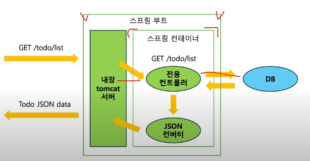
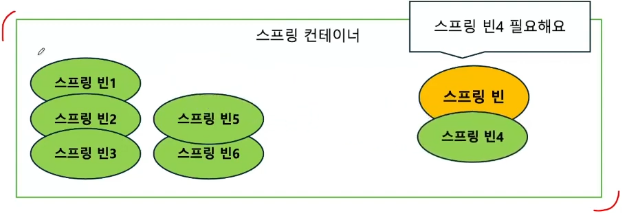

# 주제: 스피링 빈, 컨테이너

## 1. 스프링 (Spring)

- java 진영의 대표 백엔드 프레임워크
- **객체지향 원칙**을 지키면서 개발할 수 있도록 도와준다.

### 스프링 부트

- 스프링 프레임워크를 사용해 개발할 때, 편의를 제공해주는 도구
- 스프링으로 개발할 때는 스프링 부트와 함께한다.

### 스프링 어플리케이션 구조

- 전용 컨트롤러는 java 객체 형태로 반환하는데, 이는 프론트와 백엔드가 소통할 때 사용하는 json형식과 맞지 않다. -> 형식이 맞도록 스프링에서 기능을 제공해준다.
  

## 2. 스프링 빈 (Spring Bean)

- 어플리케이션 전역에서 사용할 **공용 객체**
- **스프링 컨터이너**라고 하는 공용 창고에 **빈**을 저장해두고, 필요한 빈을 컨테이너에서 받아 사용한다.
  
- 필요한 빈은 스트링 프레임워크가 자동으로 가져다 준다
  - 이때 빈을 요구하는 객체도 스프링 빈이다. -> 서로가 서로를 필요로 하는 구조.

## 3. 스프링 컨테이너

- 스프링 빈이 저장되는 공간
- 어플리케이션 컨텍스트 (Application Context)
- 중요 - 알아야할 것 !!
  - 스프링 컨테이너에 스프링 빈을 **저장하는** 법
  - 스프링 컨테이너에서 스프링 빈을 **받아오는** 법

### 스프링 빈 저장

- 1. 설정 파일 작성 (수동 등록) ✅
  - 자바 클래스로 작성한다.
  - 클래스에 `@Configuration`으로 설정 파일임을 명시한다. (꼬리표)
- 2. 컴포넌트 스캔 (자동 등록) : 표시가 되어있는 클래스에 자동으로 등록한다.

### 스프링 빈 클래스 생성

- main 폴더 > bean 패키지 > MyBean 클래스 생성하기

### 설정 파일 작성

- bean 패키지 > BeanTest 클래스 (테스트용 컨테이너) 생성
